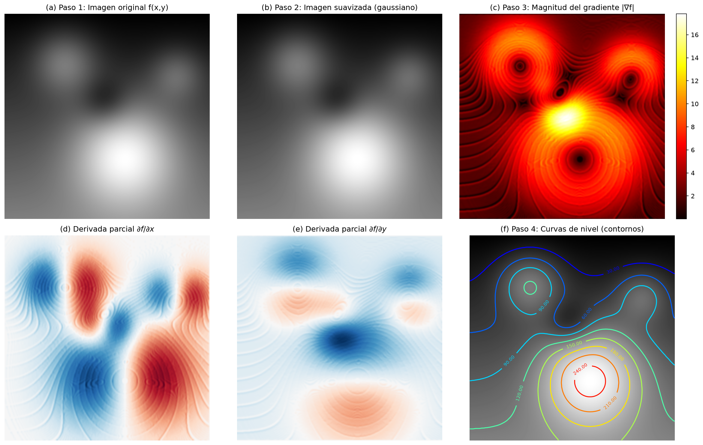
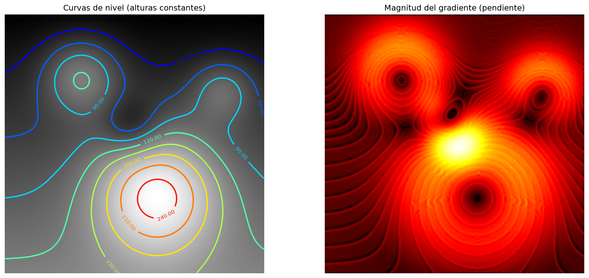

# Proyecto 1 — Mapeo de Curvas de Nivel en Imágenes
## Aplicación del Gradiente (Cálculo 2) con Asistencia de IA

**Curso:** Cálculo 2 — Ingeniería
**Integrantes:** Daniel Fernando Parra Diaz
**Fecha de entrega:** Sab 12 sept 2026

---

## 1. Marco Teórico

### 1.1 ¿Qué es una curva de nivel y cómo se relaciona con el gradiente?

Una función de dos variables $f(x, y)$ asigna un número a cada punto del plano.
Para visualizarla, una herramienta clave son las **curvas de nivel**, que son
el conjunto de puntos donde la función toma un valor constante:

$$ f(x, y) = c $$

En un mapa topográfico, cada curva de nivel une puntos que están a la misma
altura. Las curvas separadas indican terreno suave, mientras que las curvas
muy juntas indican una pendiente pronunciada.

El **gradiente** de $f$ es el vector de sus derivadas parciales:

$$ \nabla f = \left( \frac{\partial f}{\partial x},\ \frac{\partial f}{\partial y} \right) $$

El gradiente tiene dos propiedades fundamentales que conectan directamente
con las curvas de nivel:

1. **Dirección:** $\nabla f$ apunta en la dirección de *máximo crecimiento* de
   la función.
2. **Perpendicularidad:** $\nabla f$ es **siempre perpendicular** a las curvas
   de nivel en cada punto.

Esto explica por qué, en nuestro proyecto, veremos que la magnitud del
gradiente es grande exactamente donde las curvas de nivel están más apretadas
(zonas empinadas) y pequeña donde están separadas (zonas planas).

### 1.2 De la función matemática a la imagen en escala de grises

Una imagen en escala de grises es, literalmente, una función de dos variables:
cada píxel tiene una posición $(x, y)$ y un valor de intensidad (brillo) entre
0 (negro) y 255 (blanco). Ese valor de brillo es $f(x, y)$.

Por eso todo el aparato matemático del gradiente aplica de forma directa:

- $\partial f / \partial x$ mide cuánto cambia el brillo al movernos en la
  dirección horizontal.
- $\partial f / \partial y$ mide cuánto cambia al movernos en la vertical.
- La magnitud $|\nabla f|$ detecta los **bordes** (cambios bruscos de
  intensidad), que es la base del procesamiento digital de imágenes.

### 1.3 Usos del mapeo de contornos en ingeniería multimedia

- **Modelado de terrenos (GIS / topografía):** los mapas de curvas de nivel
  permiten representar la elevación de un terreno en 2D. El gradiente indica
  la pendiente y ayuda a planear carreteras, drenajes o zonas de riesgo.
- **Realidad aumentada y visión por computador:** la detección de bordes
  (magnitud del gradiente) permite reconocer objetos, esquinas y superficies
  para superponer información virtual sobre el mundo real.

---

## 2. Metodología

El trabajo se desarrolló en cuatro pasos usando **Python** con las librerías
`numpy`, `scipy` y `matplotlib`.

| Paso | Descripción | Herramienta |
|------|-------------|-------------|
| 1 | Elección de la imagen (terreno sintético definido por una función $f(x,y)$) | `numpy` + `matplotlib` |
| 2 | Suavizado con filtro gaussiano ($\sigma = 2$) | `scipy.ndimage.gaussian_filter` |
| 3 | Cálculo del gradiente con operador de Sobel | `scipy.ndimage.sobel` |
| 4 | Obtención de curvas de nivel y comparación con el gradiente | `matplotlib.contour` |

### 2.1 Justificación del suavizado previo

Derivar una señal ruidosa amplifica el ruido (la derivada de una oscilación
rápida es una oscilación grande). Por eso, antes de calcular el gradiente se
aplica un **filtro gaussiano**, que promedia cada píxel con sus vecinos
ponderados por una campana de Gauss. Esto suaviza variaciones pequeñas sin
perder la estructura grande del terreno.

### 2.2 El gradiente discreto: operador de Sobel

Como la imagen es discreta, las derivadas parciales se aproximan mediante el
**operador de Sobel**, que convoluciona la imagen con dos máscaras pequeñas
(una para $x$ y otra para $y$). Con ellas obtenemos $\partial f/\partial x$ y
$\partial f/\partial y$, y luego la magnitud:

$$ |\nabla f| = \sqrt{\left(\frac{\partial f}{\partial x}\right)^2
   + \left(\frac{\partial f}{\partial y}\right)^2} $$

---

## 3. Resultados

A continuación se muestran las imágenes de cada paso.

### Paso 1 — Imagen original

Se genera un terreno sintético definido como suma de gaussianas (montañas) más
una rampa, donde el brillo de cada píxel es la "altura" $f(x, y)$.

### Pasos 2 a 4 — Resumen

### Resultado clave — Curvas de nivel vs. gradiente

### Observaciones

- Las **curvas de nivel** dibujan con claridad la montaña principal, las
  colinas y el valle, tal como un mapa topográfico.
- La **magnitud del gradiente** es máxima precisamente en los bordes de las
  montañas, donde el brillo cambia más rápido. Esto confirma la relación
  teórica: *pendiente grande ↔ gradiente grande ↔ curvas de nivel juntas*.
- Las tres ideas (curva de nivel, gradiente y derivadas parciales) son
  totalmente coherentes entre sí, comprobando visualmente la teoría del curso.

---

## 4. Papel de la IA en el proyecto

La IA (ChatGPT / OpenCode) se usó como **asistente**, no como reemplazo del
trabajo. Las preguntas más relevantes que le hicimos fueron:

1. *"¿Por qué conviene suavizar una imagen antes de calcular el gradiente?"*
   → Nos explicó que la derivada amplifica el ruido y que un filtro gaussiano
   es la vía estándar para atenuarlo.

2. *"¿Qué librerías de Python y qué funciones se usan para el filtro de Sobel
   y las curvas de nivel?"* → Nos indicó `scipy.ndimage.sobel`,
   `scipy.ndimage.gaussian_filter` y `matplotlib.pyplot.contour`.

3. *"¿Cómo se relacionan matemáticamente las curvas de nivel con el vector
   gradiente?"* → Nos recordó que son ortogonales entre sí.

4. *"¿Cómo genero una imagen propia en escala de grises que represente una
   función $f(x,y)$?"* → Sugirió construir el terreno con gaussianas.

**Aporte:** la IA aceleró la parte de programación y aclaró conceptos, pero el
diseño del experimento, la interpretación de resultados y la redacción de este
informe fueron realizados por el grupo.

---

## 5. Reflexión sobre la experiencia de aprendizaje

Este proyecto nos permitió **materializar** un concepto abstracto: ver el
gradiente "funcionando" sobre una imagen real. Entender que cada píxel es
$f(x, y)$ y que el brillo cambia según $\nabla f$ hizo mucho más tangible la
idea de derivada parcial y de vector gradiente.

La IA fue útil sobre todo para desbloquear dudas técnicas de programación y
para reformular conceptos en ejemplos concretos. El principal aprendizaje fue
**saber qué preguntar**: la calidad de la respuesta de la IA depende de la
calidad de la pregunta, y eso exige haber estudiado la teoría antes.

---

## 6. Código fuente

El código completo y documentado se encuentra en la carpeta `codigo/`:

- `generar_terreno.py` — genera la imagen en escala de grises (Paso 1).
- `proyecto.py` — ejecuta los pasos 2 a 4 y produce las figuras de resultados.
